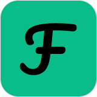
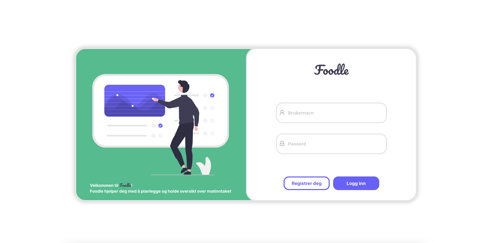

<!-- PROJECT LOGO -->
 

  

<h3 align="center">Foodle</h3>

  

    Foodle er et hobbyprosjekt som hjelper deg med å planlegge og holde oversikt over matinntaket
     
  

## Om prosjektet

...

(<a href="#readme-top">Til toppen</a>)

### Laget med

- [![React][react.js]][react-url]

(<a href="#readme-top">Til toppen</a>)

<!-- CONTACT -->

## Contact

LinkedIn - [aleksawk](https://www.linkedin.com/in/aleksawk/)

(<a href="#readme-top">Til toppen</a>)

<!-- MARKDOWN LINKS & IMAGES -->
<!-- https://www.markdownguide.org/basic-syntax/#reference-style-links -->

[react.js]: https://img.shields.io/badge/React-20232A?style=for-the-badge&logo=react&logoColor=61DAFB
[react-url]: https://reactjs.org/
